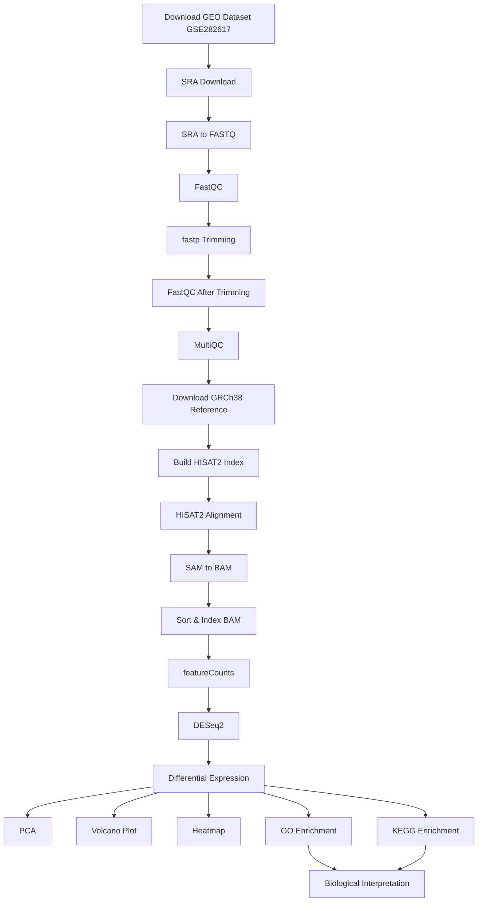

# RNA-seq Analysis Workflow

```mermaid
flowchart TD

A[Download GEO Dataset GSE282617]
-->B[SRA Download]

B-->C[SRA to FASTQ]

C-->D[FastQC]

D-->E[fastp Trimming]

E-->F[FastQC After Trimming]

F-->G[MultiQC]

G-->H[Download GRCh38 Reference]

H-->I[Build HISAT2 Index]

I-->J[HISAT2 Alignment]

J-->K[SAM to BAM]

K-->L[Sort & Index BAM]

L-->M[featureCounts]

M-->N[DESeq2]

N-->O[Differential Expression]

O-->P[PCA]

O-->Q[Volcano Plot]

O-->R[Heatmap]

O-->S[GO Enrichment]

O-->T[KEGG Enrichment]

S-->U[Biological Interpretation]

T-->U
```
